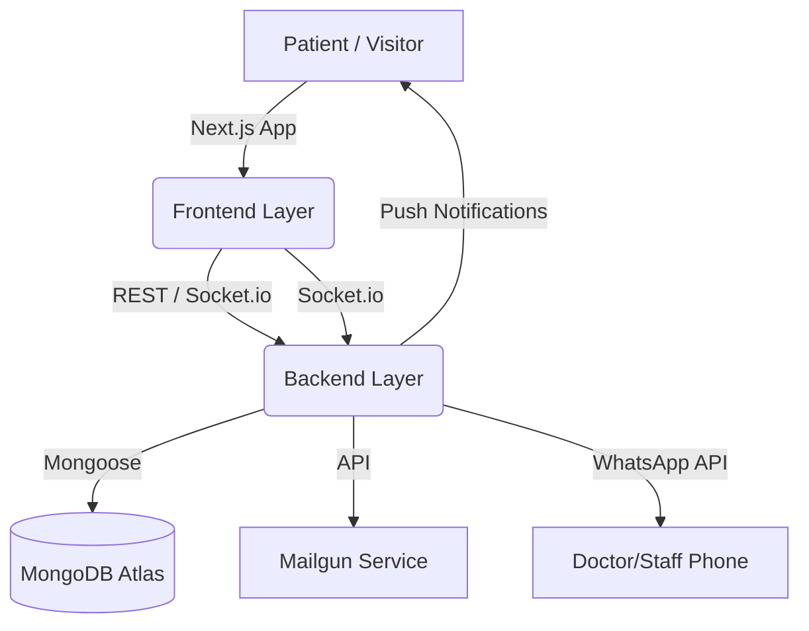

# Dr. Tooth Dental - Technical Architecture

A state-of-the-art, full-stack dental clinic management platform designed to bridge the gap between patients and modern dental care through a data-driven, visually engaging experience.

## Overview
**Dr. Tooth Dental** is a comprehensive dental ecosystem that combines advanced patient management with real-time clinic operations. 

- **Purpose**: Connecting patients and clinics through a modern web platform that prioritizes patient comfort, transparency, and operational efficiency.
- **Vision**: To modernize the dental experience using real-time synchronization and proactive communication.

---

## Features
- ✅ **Patient Booking System**: Intelligent appointment scheduling with automated slot validation.
- 🔔 **Real-Time Admin Alerts**: Immediate notifications for appointments and urgent queries via Socket.io.
- 🌐 **Communication Hub**: Integrated WhatsApp redirection, Mailgun email services, and live browser notifications.
- 📝 **Blog System**: Dynamic clinic updates, dental hygiene tips, and announcements.
- 📊 **Data-Driven Analytics**: Financial revenue tracking, customer intelligence metrics, and monthly performance pulse.
- 🖼️ **Visual Treatment Catalog**: High-resolution image-based treatment repository with 200px visual cards.

---

## System Architecture



The application follows a **Decoupled Architecture**:
1.  **Client (React/Next.js)**: Manages state using Context API and ensures a premium UI with Tailwind CSS.
2.  **Server (Express/Node.js)**: Handles business logic, authentication, and database orchestrations.
3.  **Real-Time Sync**: Socket.io ensures that any change in schedules or patients is reflected instantly across all admin instances.

---

## Tech Stack

### Frontend: Next.js
- **React 19**: Utilizing Concurrent Mode and the latest hooks.
- **Tailwind CSS 4**: For a premium, glassmorphic UI design.
- **Socket.io-client**: For live data streaming.
- **Axios**: Robust HTTP client for API communication.

### Backend: Express.js + Socket.io
- **Node.js**: Asynchronous event-driven runtime.
- **Socket.io**: Bidirectional event-based communication.
- **Mailgun**: Scalable email delivery for transaction alerts.

### Database: MongoDB
- **Mongoose**: Object Data Modeling (ODM) for schema-based data integrity.
- **Atlas**: Highly available cloud-hosted clusters.

---

## Installation

### Prerequisites
- [Node.js](https://nodejs.org/) (v18+)
- [MongoDB](https://www.mongodb.com/try/download/community) (Local or Atlas)
- [NPM](https://www.npmjs.com/) or [Yarn](https://yarnpkg.com/)

### Steps
1.  **Clone the Repository**:
    ```bash
    git clone https://github.com/himesh220002/dentalProject.git
    cd dr-tooth-dental-clinic
    ```

2.  **Install Client Dependencies**:
    ```bash
    cd client
    npm install
    ```

3.  **Install Server Dependencies**:
    ```bash
    cd ../server
    npm install
    ```

4.  **Environment Variable Setup**:
    Create `.env` files in both `client` and `server` folders.
    - **Server .env**: `MONGO_URI`, `PORT`, `MAILGUN_API_KEY`, `JWT_SECRET`
    - **Client .env**: `NEXT_PUBLIC_API_URL`, `NEXT_PUBLIC_SOCKET_URL`

---

## Usage

### Run Development Server
- **Start Backend**:
  ```bash
  cd server
  npm run dev
  ```
- **Start Frontend**:
  ```bash
  cd client
  npm run dev
  ```

### Admin Access
- Navigate to `/temppath` to access the **Version Control & Handover Dashboard**.
- Use the **Quick Scheduler** for internal appointment management.

---

## Patient Journey Flow
1.  **Discovery**: Patient browses high-quality treatment images and clinic milestones.
2.  **Authentication**: Secure login/signup via NextAuth for profile management.
3.  **Booking**: Selection of treatments and time slots with real-time availability check.
4.  **Post-Visit**: Automatic history generation and digital receipt management.

---

## Communication Hub
- **WhatsApp**: Direct redirection with pre-filled context (`Regarding Dental - `).
- **Mailgun**: Professional email confirmations for every booking.
- **Socket.io**: Instant alerts to the clinic's front desk for every new appointment.

---

## Data Management
- **Patient Profiles**: Centralized history of treatments, payments, and appointments.
- **Financial Ledger**: "Financial Revenue Pulse" tracking monthly collections.
- **Traffic Analytics**: Basic intelligence on customer acquisition and treatment frequency.

---

## Future Enhancements
- 🤖 **AI Appointment Recommendations**: Predictive scheduling based on patient history.
- 🏥 **Multi-Clinic Support**: Single dashboard for managing multiple clinic branches.
- 📱 **Mobile Native App**: Dedicated iOS and Android apps for patients.

---

## Contributing
We welcome contributions!
1.  Fork the Project.
2.  Create your Feature Branch (`git checkout -b feature/AmazingFeature`).
3.  Commit your Changes (`git commit -m 'Add some AmazingFeature'`).
4.  Push to the Branch (`git push origin feature/AmazingFeature`).
5.  Open a Pull Request.

---

## License
Distributed under the **MIT License**. See `LICENSE` for more information.

---

## Acknowledgments
- [React Icons](https://react-icons.github.io/react-icons/) for the beautiful UI icons.
- [Unsplash](https://unsplash.com/) for the professional dental imagery.
- All the medical staff who provided workflow insights.
