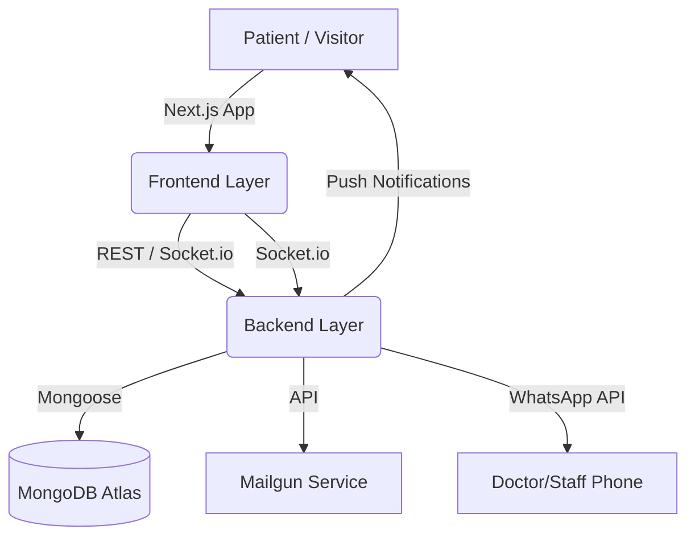

<div align="center">

# ToothOp — Clinic Management Platform

**A secure, end-to-end dental clinic management system designed to streamline patient care, automated scheduling, and clinical operations.**

<br/>


</div>

---

## 📌 Overview

**ToothOp** addresses critical operational inefficiencies in clinical workflows by integrating patient electronic health records (EHR), dynamic doctor scheduling, multi-tier billing, and role-based staff permissions into a unified interface.

### Key Capabilities

* 🩺 **Patient Journey Tracking:** Complete digital intake, diagnosis records, and visit histories.
* 📅 **Intelligent Scheduling:** Conflict-free doctor appointment slotting with automated status transitions.
* 🔐 **Role-Based Access Control (RBAC):** Distinct permissions and dashboards for Doctors, Receptionists, and Administrators.
* 💳 **Invoicing & Ledger:** Automated treatment billing with itemized receipt generation.
* ⚡ **Real-Time Updates:** Immediate doctor dashboard synchronization upon patient check-in.

---

## 🏗️ System Architecture


```mermaid
graph TD
    A[Patient / Visitor] -->|Next.js App| B(Frontend Layer)
    B -->|REST / Socket.io| C(Backend Layer)
    C -->|Mongoose| D[(MongoDB Atlas)]
    C -->|API| E[Mailgun Service]
    C -->|WhatsApp API| F[Doctor/Staff Phone]
    B -->|Socket.io| C
    C -->|Push Notifications| A
```

The application follows a **Decoupled Architecture**:  

* **Client (React / Next.js):** Manages state using Context API and ensures a responsive UI built with Tailwind CSS.  
* **Server (Express / Node.js):** Handles business logic, authentication middleware, and database orchestrations.  
* **Real-Time Sync:** Socket.io ensures that any change in schedules or patients is reflected instantly across all admin instances.  

---

## 💻 Tech Stack

### Frontend: Next.js
* **React 19:** Concurrent Mode support and modern hooks lifecycle.
* **Tailwind CSS 4:** Responsive design engine with optimized glassmorphic interface elements.
* **Socket.io-client:** Persistent duplex channel for live appointment and check-in streams.
* **Axios:** Promise-based HTTP client for typed REST communication.

### Backend: Express.js + Socket.io
* **Node.js:** Event-driven asynchronous runtime.
* **Socket.io:** Real-time bi-directional messaging gateway.
* **Mailgun:** Cloud delivery API for transactional alerts and booking updates.
* **JSON Web Tokens (JWT):** Stateless token authorization and role-based access validation.

### Database & Persistence: MongoDB
* **Mongoose:** Strict schema definition, hooks, and automated validation rules.
* **MongoDB Atlas:** Managed multi-region cloud cluster deployment.

---

## 🚀 Installation

### Prerequisites
* Node.js `>= 18.x`
* MongoDB (Local daemon or MongoDB Atlas URI)
* `npm` or `yarn`

### Steps

1. **Clone the Repository:**
   ```bash
   git clone https://github.com/himesh220002/dentalProject.git
   cd dentalProject
   ```

2. **Install Client Dependencies:**
   ```bash
   cd client
   npm install
   ```

3. **Install Server Dependencies:**
   ```bash
   cd ../server
   npm install
   ```

4. **Environment Variable Setup:**  
   Configure `.env` files in both the client and server directories:

   **`server/.env`**
   ```env
   PORT=5000
   MONGO_URI=your_mongodb_connection_string
   JWT_SECRET=your_jwt_secret_key
   MAILGUN_API_KEY=your_mailgun_api_key
   NODE_ENV=development
   ```

   **`client/.env`**
   ```env
   NEXT_PUBLIC_API_URL=http://localhost:5000/api
   NEXT_PUBLIC_SOCKET_URL=http://localhost:5000
   ```

---

## ⚡ Usage

### Run Development Server

* **Start Backend:**
  ```bash
  cd server
  npm run dev
  ```

* **Start Frontend:**
  ```bash
  cd client
  npm run dev
  ```

### Admin Access
* Navigate to `/temppath` to access the **Version Control & Handover Dashboard**.
* Use the **Quick Scheduler** for internal appointment management.

---

## 🔄 Patient Journey Flow

```
[ 1. Discovery ] ──► [ 2. Authentication ] ──► [ 3. Dynamic Booking ] ──► [ 4. Post-Visit Records ]
 Browse services        NextAuth session        Real-time slot check         Automated history &
 & treatment catalog    profile verification      with doctor sync          digital receipt ledger
```

* **Discovery:** Patient explores clinical services, treatment breakdowns, and doctor profiles.
* **Authentication:** Secure registration and session validation via NextAuth.
* **Booking:** Selection of treatments and scheduling slots with real-time conflict checks.
* **Post-Visit:** Automatic clinical history logging, billing calculation, and digital receipt delivery.

---

## 📡 Communication Hub

* **WhatsApp:** Context-aware routing directly to clinic representatives (`Regarding Dental - `).
* **Mailgun:** Automated dispatch of appointment itineraries, invoices, and confirmation emails.
* **Socket.io:** Low-latency desktop alerts delivered to clinic terminals on patient arrival.

---

## 📊 Data Management & Analytics

* **Patient Profiles:** Centralized historical ledger of medical notes, prescription plans, and invoices.
* **Financial Ledger:** "Financial Revenue Pulse" component tracking monthly receivables and pending bills.
* **Traffic Analytics:** Telemetry dashboard mapping patient retention and treatment demand frequencies.

---

## 🔮 Future Enhancements

* 🤖 **AI Appointment Recommendations:** Predictive scheduling suggestions based on clinical treatment history.
* 🏥 **Multi-Clinic Support:** Multi-tenant database schema for centralized administration across clinic branches.
* 📱 **Mobile Native Companion:** Dedicated client portal built with React Native.

---

## 🤝 Contributing

1. Fork the project repository
2. Create a feature branch:
   ```bash
   git checkout -b feature/Optimization
   ```
3. Commit changes:
   ```bash
   git commit -m 'feat: optimize scheduler re-renders'
   ```
4. Push to origin:
   ```bash
   git push origin feature/Optimization
   ```
5. Open a Pull Request

---

## 📄 License

Distributed under the **MIT License**. See `LICENSE` for details.

---

## 💙 Acknowledgments

* [React Icons](https://react-icons.github.io/react-icons/) for scalable interface iconography.
* [Unsplash](https://unsplash.com/) for high-resolution clinical assets.
* Clinical healthcare professionals who provided feedback on real-world workflow constraints.
